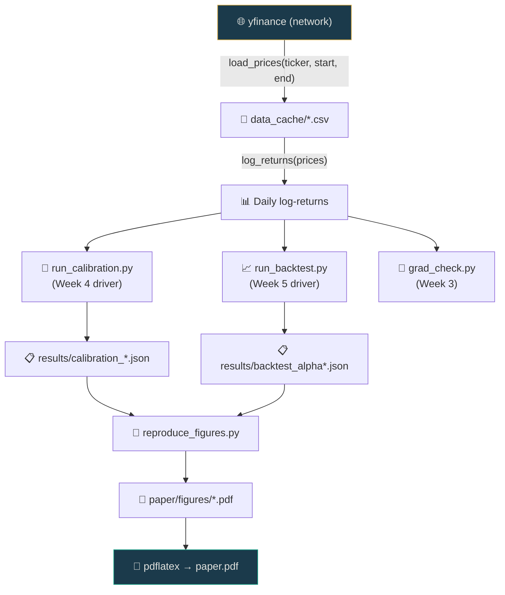

# Pipeline

> Reading order if you want to understand the full data flow.

## Architecture diagram

## Step-by-step

Each box in the diagram above is one command. See the [Quickstart](../getting-started/quickstart.md) for the exact commands.

1. **Data loading** — `stochastech/data/loaders.py` pulls equity prices from yfinance and caches as CSV.
2. **Log-returns** — computed from adjusted close prices.
3. **Calibration** — rolling-window Heston fit via BPTT or gradient-free baseline.
4. **Backtesting** — walk-forward 1-day VaR with monthly refit. Three methods compared.
5. **Figures** — reads JSON results and writes vector PDFs.
6. **Paper** — pdflatex compiles the LaTeX source with generated figures.
