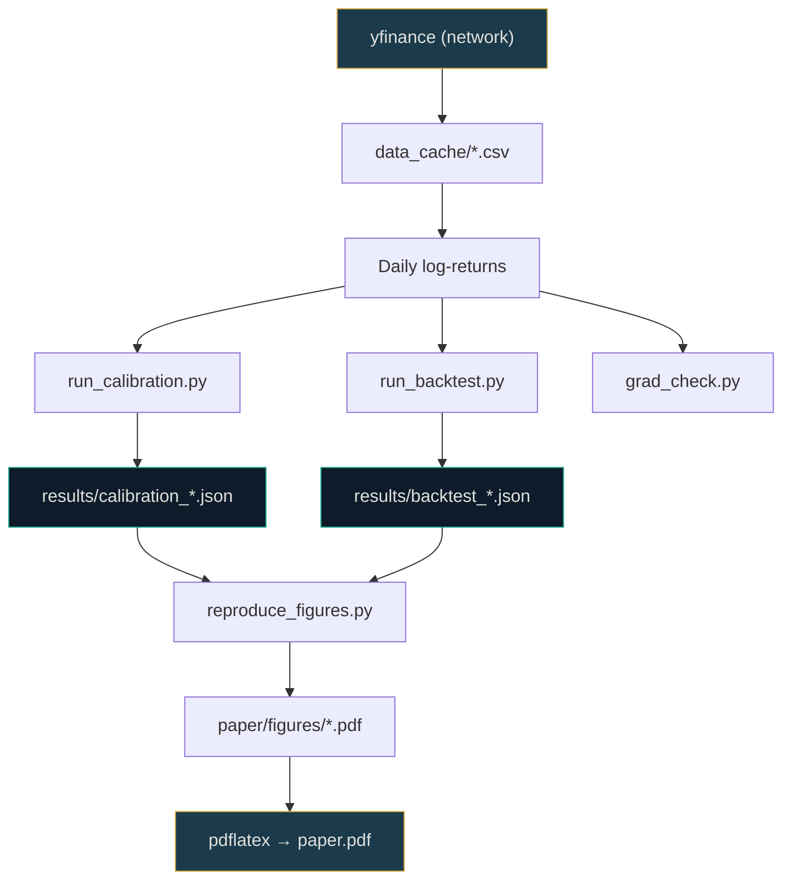

---
hide:
  - navigation
  - toc
---

<div class="hero" markdown>

# StochasTech

<p class="hero-subtitle">
Differentiable Heston-model calibrator with Monte Carlo VaR backtesting on real equity data. A research-grade Python framework for simulation-based financial risk analysis.
</p>

[:octicons-rocket-16: Get Started](getting-started/overview.md){ .md-button .md-button--primary }
[:octicons-book-16: Read the Math](math/index.md){ .md-button }
[:octicons-mark-github-16: GitHub](https://github.com/AmineChr54/StochasTech){ .md-button }

</div>

<div class="feature-grid" markdown>

<div class="feature-card" markdown>
<span class="feature-icon">📐</span>

### SDE Simulator

Vectorized Euler–Maruyama for GBM and Heston in PyTorch. Full-truncation scheme, Cholesky-correlated noise, antithetic variates.

[:octicons-arrow-right-16: Math foundations](math/heston.md)
</div>

<div class="feature-card" markdown>
<span class="feature-icon">🧠</span>

### Differentiable Calibrator

Backpropagate through the SDE solver to fit Heston parameters $(κ, θ, ξ, ρ, v_0)$ via Adam. Energy distance and Gaussian-KDE NLL losses.

[:octicons-arrow-right-16: Calibration method](math/adjoint-sde.md)
</div>

<div class="feature-card" markdown>
<span class="feature-icon">⚡</span>

### Risk Module

Monte Carlo VaR and Expected Shortfall. Kupiec POF, Christoffersen independence, and conditional coverage backtests.

[:octicons-arrow-right-16: VaR backtesting](math/var-backtesting.md)
</div>

<div class="feature-card" markdown>
<span class="feature-icon">📄</span>

### Research Paper

8–12 page paper with full derivations, method, experiments, and results. Reproducible from a single script.

[:octicons-arrow-right-16: Build the paper](paper/building.md)
</div>

</div>

---

## Quick Start

<div class="install-box" markdown>

```bash
# Install the environment
pixi install

# Run all 120+ tests
pixi run test

# Rolling-window calibration on SPY/AAPL/MSFT
pixi run -e dev python scripts/run_calibration.py \
    --tickers SPY AAPL MSFT --window 504 --step 252

# Out-of-sample VaR backtest
pixi run -e dev python scripts/run_backtest.py \
    --tickers SPY AAPL MSFT --window 504 --step 21 --alpha 0.95

# Generate paper figures and build the PDF
pixi run -e dev python scripts/reproduce_figures.py
```

</div>

---

## Project Layout

| Path | Purpose |
|------|---------|
| [`stochastech/`](https://github.com/AmineChr54/StochasTech/tree/main/stochastech) | Library source — SDE simulators, calibration, risk, viz |
| [`tests/`](https://github.com/AmineChr54/StochasTech/tree/main/tests) | pytest suite (120+ tests, includes math-doc parity) |
| [`doc/`](https://github.com/AmineChr54/StochasTech/tree/main/doc) | Overview, roadmap, math derivations, methods, architecture |
| [`scripts/`](https://github.com/AmineChr54/StochasTech/tree/main/scripts) | Driver scripts for calibration, backtesting, figures |
| [`paper/`](https://github.com/AmineChr54/StochasTech/tree/main/paper) | LaTeX source + bib + figures for the paper |

---

## The Pipeline



---

## Key Claim

> **Accurate financial risk forecasting depends not only on model choice but on parameter calibration.** Differentiable calibration through the SDE solver delivers better VaR coverage than closed-form GBM-MLE on out-of-sample data.

---

## Binding Rule

Every code module under `stochastech/sde/` and `stochastech/calibration/` ships with a paired LaTeX-bearing math doc under [`doc/math/`](math/index.md). Pull requests without the math doc fail CI. See [Scope](project/scope.md).

---

<div style="text-align: center; color: var(--md-default-fg-color--light); font-size: 0.85rem; margin-top: 2rem;">

**Phase 1** — Python/PyTorch MVP + Paper &nbsp; · &nbsp; **Status**: Week 6 (polish)

</div>
